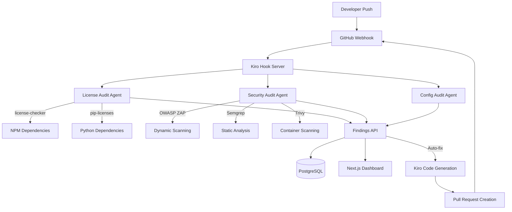

# Design Document

## Overview

RepoFlight is architected as a distributed system that integrates deeply with Kiro's agent hooks and spec-driven development workflow. The system consists of microservices that handle different aspects of compliance and security scanning, orchestrated through GitHub webhooks and Kiro automation. The architecture prioritizes performance, extensibility, and seamless integration with existing development workflows.

## Architecture

### High-Level System Architecture



### Component Architecture

The system follows a microservices pattern with clear separation of concerns:

1. **Hook Server**: Central orchestrator that receives GitHub webhooks and triggers appropriate scanning agents
2. **Scanning Agents**: Specialized services for different types of analysis (license, security, configuration)
3. **Findings API**: Centralized data layer that aggregates results and provides unified access
4. **Dashboard**: User-facing interface for visualization and management
5. **Auto-Fix Engine**: Kiro-powered remediation system that generates fixes and pull requests

## Components and Interfaces

### Hook Server (TypeScript/Express)

**Responsibilities:**
- Receive and validate GitHub webhooks
- Orchestrate scanning workflows based on repository events
- Manage scan queuing and parallel execution
- Interface with Kiro agent hooks for automation

**Key Interfaces:**
```typescript
interface WebhookPayload {
  repository: Repository;
  commits: Commit[];
  pull_request?: PullRequest;
  action: 'opened' | 'synchronize' | 'closed';
}

interface ScanRequest {
  repositoryId: string;
  commitSha: string;
  scanTypes: ('license' | 'security' | 'config')[];
  priority: 'high' | 'normal' | 'low';
}
```

### License Audit Agent (Node.js)

**Responsibilities:**
- Parse dependency files (package.json, requirements.txt, go.mod)
- Extract license information using license-checker and pip-licenses
- Compare against forbidden license policies
- Generate SPDX inventory reports

**Key Interfaces:**
```typescript
interface LicenseFindings {
  repositoryId: string;
  scanId: string;
  dependencies: DependencyLicense[];
  violations: LicenseViolation[];
  spdxReport: SPDXDocument;
}

interface DependencyLicense {
  name: string;
  version: string;
  license: string;
  licenseFile?: string;
  repository?: string;
}
```

### Security Audit Agent (Python)

**Responsibilities:**
- Execute OWASP ZAP Automation Framework for DAST
- Run Semgrep for SAST analysis
- Perform container scanning with Trivy
- Generate SARIF reports for GitHub integration

**Key Interfaces:**
```python
@dataclass
class SecurityFindings:
    repository_id: str
    scan_id: str
    sast_results: List[SASTFinding]
    dast_results: List[DASTFinding]
    container_results: List[ContainerFinding]
    sarif_report: SARIFReport
```

### Findings API (PostgreSQL + Prisma)

**Responsibilities:**
- Store and aggregate scan results
- Provide REST and GraphQL endpoints
- Calculate risk scores and compliance mappings
- Manage scan history and audit trails

**Database Schema:**
```prisma
model Repository {
  id          String   @id @default(cuid())
  githubId    Int      @unique
  name        String
  owner       String
  scans       Scan[]
  policies    Policy[]
  createdAt   DateTime @default(now())
  updatedAt   DateTime @updatedAt
}

model Scan {
  id           String      @id @default(cuid())
  repositoryId String
  commitSha    String
  scanType     ScanType
  status       ScanStatus
  findings     Finding[]
  riskScore    Float?
  startedAt    DateTime    @default(now())
  completedAt  DateTime?
  
  repository   Repository  @relation(fields: [repositoryId], references: [id])
}

model Finding {
  id          String       @id @default(cuid())
  scanId      String
  type        FindingType
  severity    Severity
  title       String
  description String
  location    Json?
  metadata    Json?
  status      FindingStatus @default(OPEN)
  
  scan        Scan         @relation(fields: [scanId], references: [id])
}
```

### Dashboard (Next.js 14)

**Responsibilities:**
- Server-side rendered pages with real-time updates
- Risk score visualization and trend analysis
- Compliance framework mapping and reporting
- Badge generation for README integration

**Key Components:**
- Risk Dashboard with real-time WebSocket updates
- Dependency Tree visualization using D3.js
- CVE Timeline with filtering and search
- Compliance Reports with PDF export
- Settings panel for policy configuration

## Data Models

### Core Data Structures

**Risk Scoring Model:**
```typescript
interface RiskScore {
  overall: number; // 0-100
  license: number;
  security: number;
  configuration: number;
  trend: 'improving' | 'stable' | 'degrading';
  lastUpdated: Date;
}

interface ComplianceMapping {
  framework: 'OWASP_TOP_10' | 'CIS_BENCHMARKS' | 'SOC_2';
  controls: ControlMapping[];
  overallCompliance: number;
}
```

**Policy Configuration:**
```typescript
interface PolicyConfig {
  forbiddenLicenses: string[];
  cvssThreshold: number;
  requiredHeaders: string[];
  customRules: CustomRule[];
  exemptions: PolicyExemption[];
}
```

### Integration with Kiro Specs

The system leverages Kiro's spec-driven development through:

1. **Requirements Integration**: Policy configurations reference specific requirements
2. **Design Artifacts**: Auto-generated sequence diagrams and data models
3. **Task Management**: Sprint backlogs with granular implementation tasks
4. **Agent Hooks**: Automated triggers for scanning workflows

## Error Handling

### Resilience Patterns

**Circuit Breaker Pattern:**
- Implement circuit breakers for external scanner integrations
- Fail fast when scanners are unavailable
- Provide degraded functionality with cached results

**Retry Logic:**
- Exponential backoff for transient failures
- Dead letter queues for failed scan requests
- Manual retry capabilities through dashboard

**Error Classification:**
```typescript
enum ErrorType {
  SCANNER_UNAVAILABLE = 'scanner_unavailable',
  TIMEOUT = 'timeout',
  INVALID_REPOSITORY = 'invalid_repository',
  RATE_LIMIT_EXCEEDED = 'rate_limit_exceeded',
  CONFIGURATION_ERROR = 'configuration_error'
}
```

### Monitoring and Alerting

- Structured logging with correlation IDs
- Metrics collection for scan performance and success rates
- Health checks for all microservices
- Integration with observability platforms (Datadog, New Relic)

## Testing Strategy

### Multi-Layer Testing Approach

**Unit Testing (90% coverage target):**
- Jest for TypeScript components
- pytest for Python security agents
- Mock external scanner dependencies
- Test policy evaluation logic

**Integration Testing:**
- Supertest for API endpoints
- Database integration with test containers
- Scanner integration with controlled test repositories
- GitHub webhook simulation

**Security Testing:**
- Semgrep analysis on RepoFlight codebase itself
- Container scanning of built images
- OWASP ZAP scanning of dashboard application
- Dependency vulnerability scanning

**End-to-End Testing:**
- Playwright for dashboard workflows
- GitHub App installation and webhook flow
- Complete scan-to-remediation cycles
- Multi-repository testing scenarios

### Test Data Management

- Synthetic repositories with known vulnerabilities
- License violation test cases
- Performance benchmarking datasets
- Compliance framework validation suites

## Performance Considerations

### Scalability Design

**Horizontal Scaling:**
- Containerized agents with Kubernetes orchestration
- Load balancing across multiple hook server instances
- Database read replicas for dashboard queries
- CDN integration for static assets

**Caching Strategy:**
- Redis for scan result caching
- Browser caching for dashboard assets
- Dependency license information caching
- CVE database local caching

**Performance Targets:**
- Scan completion: <120 seconds per PR
- Dashboard load time: <2 seconds
- API response time: <500ms (95th percentile)
- Concurrent scan capacity: 50+ repositories

### Resource Optimization

- Parallel scanning execution
- Incremental scanning for large repositories
- Efficient database queries with proper indexing
- Memory-optimized container configurations

## Security Architecture

### Authentication and Authorization

- GitHub App authentication for repository access
- JWT tokens for API authentication
- Role-based access control (RBAC)
- Audit logging for all administrative actions

### Data Protection

- Encryption at rest for sensitive scan data
- TLS encryption for all network communication
- Secure credential management with HashiCorp Vault
- Data retention policies and secure deletion

### Supply Chain Security

- Signed container images
- Dependency pinning and verification
- Regular security updates for base images
- SBOM generation for RepoFlight itself

## Deployment Architecture

### Infrastructure Components

**Production Environment:**
- Kubernetes cluster with auto-scaling
- PostgreSQL with high availability
- Redis cluster for caching
- Load balancers with SSL termination

**CI/CD Pipeline:**
- GitHub Actions for automated testing
- Container registry with vulnerability scanning
- Staged deployments with rollback capabilities
- Infrastructure as Code with Terraform

### Monitoring and Observability

- Prometheus metrics collection
- Grafana dashboards for system health
- Distributed tracing with Jaeger
- Log aggregation with ELK stack

This design provides a robust, scalable foundation for RepoFlight that leverages Kiro's capabilities while maintaining high performance and reliability standards.